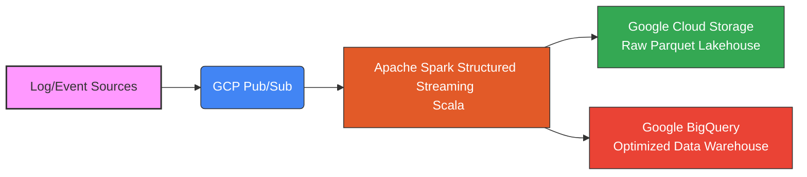

# Real-Time Distributed Log Analytics & Observability Engine

A production-grade, distributed data platform built to ingest, process, and analyze high-throughput system logs and clickstream events at scale. This project demonstrates enterprise-level data engineering practices using **Scala, Apache Spark, and Google Cloud Platform (GCP)**, optimized for high-volume data processing, minimal processing latency, and cost-effective cloud storage.

---

## 🏗️ System Architecture


### Architectural Highlights
*   **Decoupled Ingestion:** Scales independently to handle sudden traffic spikes using GCP Pub/Sub as a high-throughput message broker.
*   **Stateful Stream Processing:** Leverages Spark Structured Streaming in Scala for micro-batch processing, schema validation, and real-time aggregations.
*   **Dual-Storage Strategy:** Sinks raw data into GCS (Parquet format partitioned by date/hour for cost-efficient cold storage) and streams enriched analytical metrics into BigQuery for near zero-latency SQL querying.

---

## 🛠️ Tech Stack & Engineering Tools

*   **Language:** Scala 2.12+ (Functional patterns, strong typing, and native Spark compatibility)
*   **Stream Processing:** Apache Spark 3.x (Structured Streaming, Spark SQL)
*   **Cloud Infrastructure:** Google Cloud Platform (GCP)
    *   **GCP Pub/Sub:** Event ingestion layer
    *   **Dataproc:** Managed Spark cluster execution
    *   **BigQuery:** Analytics data warehousing with partitioned/clustered tables
    *   **Cloud Storage (GCS):** Raw data lake landing zone
*   **Build Tool:** Maven

---

## 📊 Mock Data Strategy & Sources

To simulate real-world enterprise traffic without maintaining live, expensive server farms, this pipeline ingests high-cardinality log data sourced and generated through the following methods:

1.  **Public Enterprise Datasets:**
    *   **[The Loghub Repository](https://github.com/logpai/loghub):** A collection of real-world, large-scale system logs (e.g., HDFS clusters, Android systems, Linux servers, OpenStack). Excellent for backfilling GCS to test batch processing and historical analytical queries.

> 💡 **Simulation Strategy:** A lightweight Python/Go background script reads from `flog` or `loghub` raw files and streams them into the GCP Pub/Sub topic at a rate of 1,000+ events/sec to replicate a live production environment.

---

## ⚡ Performance Optimizations & Production Hardening

*   **Data Skew Mitigation:** Implemented custom salting keys during Spark aggregations to prevent partition bottlenecks across the Dataproc cluster.
*   **BigQuery Cost Control:** Target tables utilize **Time-unit partitioning** (on ingestion timestamp) and **Clustering** (on `error_code` and `service_name`) to drastically reduce slot consumption and query costs.
*   **Memory Management:** Fine-tuned JVM garbage collection flags on Spark executors to prevent `OutOfMemory` errors during heavy stateful processing windows.

---

## 🚀 Getting Started

### Prerequisites
*   GCP Account with a Google Cloud Project initialized.
*   Google Cloud SDK installed locally and authenticated (`gcloud auth application-default login`).
*   Java Development Kit (JDK 8 or 11).
*   Maven.

### 1. Setup GCP Infrastructure
```bash
# Create a Pub/Sub Topic and Subscription
gcloud pubsub topics create log-ingest-topic
gcloud pubsub subscriptions create log-ingest-sub --topic=log-ingest-topic

# Create a GCS Bucket for Raw Storage
gsutil mb -l us-central1 gs://my-log-analytics-lakehouse

# Create BigQuery Dataset
bq mk --location=US log_analytics_dw
